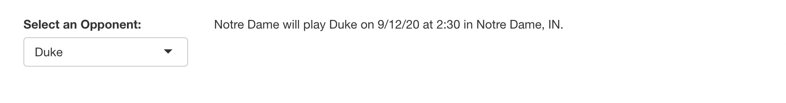
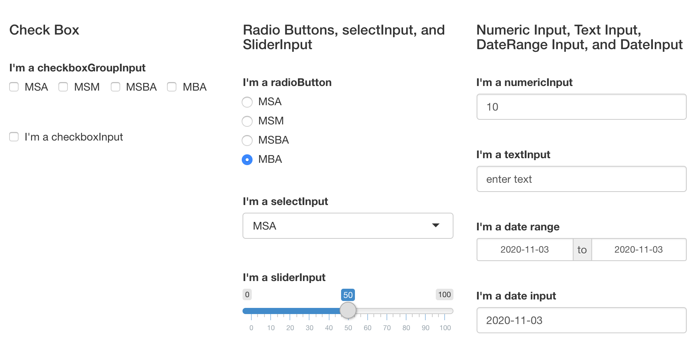
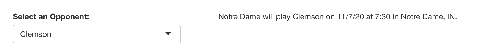
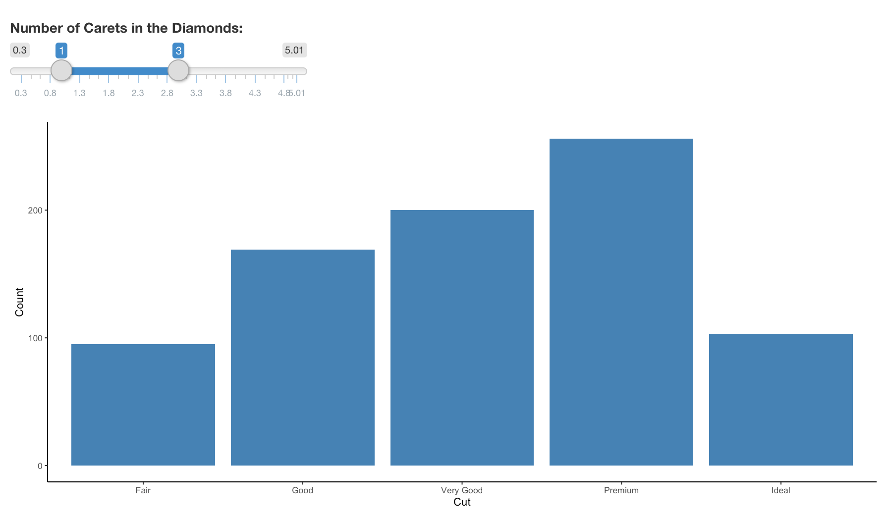
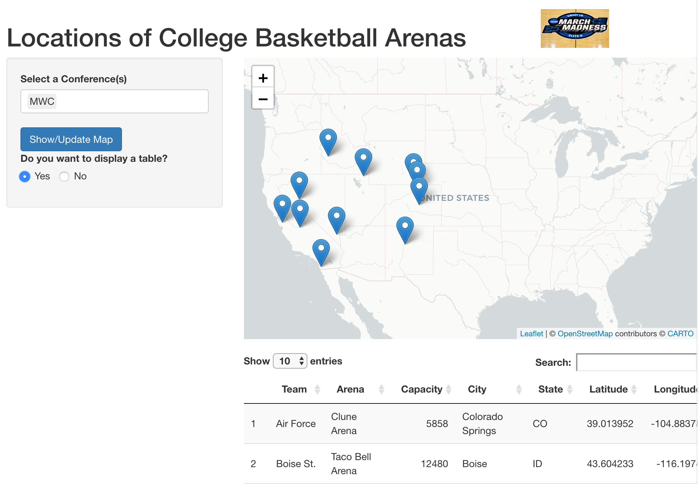

```{r setup, include=FALSE}
knitr::opts_chunk$set(echo = TRUE, warning = FALSE, message = FALSE)
```

## What is Shiny?

Shiny is a package in R that provides the ability to combine your analytical work with an interactive web application. You can create applications that run locally on your computer or on the web using services such as [AWS](https://www.charlesbordet.com/en/guide-shiny-aws/#) to deploy your app on the web. The great thing about Shiny is that you do not have to write any CSS, HTML, or JavaScript.

Shiny applications have two defining elements a ui and server. The server is a function that interacts with the ui in continuum as long as the application is running. These two elements are combined and run in the R script by running the command shinyApp(ui, server). When the application is running, the user can change inputs in the ui that will alter the server's elements. The basic flow of a Shiny application is as follows:

```{r eval = F, echo = T}
library(shiny)

server <- function(input, output) {
  # Some Code
}

ui <- fluidPage(
  # Some Code 
)

shinyApp(ui, server)
```

NOTE: Sometimes, you may need to include a "session" in the server function; however, for our purposes today, we will not use this element. Usually, Shiny Apps will require a session element when there are many reactive elements in the application.

```{r eval = F, echo = T}
server <- function(input, output, session) {
  # Some Code
}
```

## Basic Example:

So what if we wanted details on the game times and locations of the Notre Dame schedule. I created a data frame with the falling information about the Notre Dame 2020 football schedule.

```{r eval = T, echo = F}
library(data.table)

schedule <- read.csv("https://raw.githubusercontent.com/jjenki22/ShinyWorkshop/main/Data/NDSchedule.csv")

DT::datatable(schedule,
              options = list(pageLength = 11))
```

Now let's create a shiny app that makes a sentence such as "Notre Dame will play Syracuse on 12/5/20 at 2:30 in Notre Dame, IN."

```{r eval = F, echo = T}
schedule <- read.csv("https://raw.githubusercontent.com/jjenki22/ShinyWorkshop/main/Data/NDSchedule.csv")

ui <- fluidPage(
  br(),
  column(5,
         selectInput("teamSelected",
                     "Select an Opponent:",
                     choices = schedule$Opponent)),
  column(7,
         textOutput("text"))
)

server <- function(input, output) {
  
  output$text <- renderText({
    selectedGame <- schedule %>% 
      filter(Opponent == input$teamSelected)
    paste("Notre Dame will play ",
          selectedGame$Opponent,
          " on ",
          as.character(selectedGame$Date),
          " at ",
          as.character(selectedGame$GameTime),
          " in ",
          as.character(selectedGame$Location),
          ".",
          sep = "")
  })
}

shinyApp(ui, server)
```



So what is going on here? First, we read in the data file titled NDSchedule and then set the column to 5 in the fluidpage. In shiny, each page you create has 12 columns, which you can use as you wish. In addition, you can have as many rows as you want. We used the function selectInput to create a drop-down based on the opponents in the NDSchedule.csv data file. Next, we made another column, this time with a width of 7, and used textOutput to output the text created in the server. So what is going on in the server?

Well, first, remember the server and UI are continually interacting with each other. Thus, when you select a different opponent in the UI, the inputs are changed, and the server output updates. We used the function renderText to create the text and used the dplyr option "filter" to select the opponent the user selected. From here, we used paste to create the sentence. If the user changes their input to something else, the process starts all over again, and output$text updates accordingly. You can download/view the code for the basic example [here](https://github.com/jjenki22/ShinyWorkshop/blob/main/ShinyBasicExample.R)

## UI Elements: 

Here, we look at some basic UI elements in Shiny. This list is by no means exhaustive. There are MANY elements and a simple search on google and stack overflow can lead to discovering others.

```{r eval = F, echo=T}
server <- function(input, output) {
  
}

ui <- fluidPage(
  br(),
  fluidRow(
    column(4, 
           tags$h4("Check Box"),
           br(),
           checkboxGroupInput("checkboxGroupID",
                              "I'm a checkboxGroupInput",
                              c("MSA", 
                                "MSM",
                                "MSBA",
                                "MBA"),
                              inline = TRUE),
           br(),
           checkboxInput("checkboxInputID",
                         "I'm a checkboxInput")),
    column(4,
           tags$h4("Radio Buttons, selectInput, and SliderInput"),
           br(),
           radioButtons("radioButtonID",
                        "I'm a radioButton",
                        c("MSA",
                          "MSM",
                          "MSBA",
                          "MBA"),
                        select = "MBA",
                        inline = FALSE),
           br(),
           selectInput("selectInputID",
                       "I'm a selectInput",
                       c("MSA",
                         "MSM",
                         "MSBA",
                         "MBA"),
                       multiple = FALSE),
           br(),
           sliderInput("sliderInputID",
                       "I'm a sliderInput",
                       min = 0,
                       max = 100,
                       value = 50,
                       step = 5)),
    column(4,
           tags$h4("Numeric Input, Text Input, DateRange Input, and DateInput"),
           br(),
           numericInput("numericInputID",
                        "I'm a numericInput",
                        value = 10),
           br(),
           textInput("textInputID",
                     "I'm a textInput",
                     "enter text"),
           br(),
           dateRangeInput("dateRangeInputID",
                          "I'm a date range"),
           br(),
           dateInput("dateInputID",
                     "I'm a date input")
  )
))

shinyApp(ui, server)
```



Very cool stuff! But what if we wanted to create a UI element in the server? We can do that! Let's go back to our Notre Dame football example above, however, this time, we will render the select input in the server. 

```{r eval = F, echo = T}
schedule <- read.csv("https://raw.githubusercontent.com/jjenki22/ShinyWorkshop/main/Data/NDSchedule.csv")

server <- function(input, output) {
  output$TeamSelectedUIOutput <- renderUI({
    selectInput("teamSelected",
                "Select an Opponent:",
                choices = schedule$Opponent)
  })
  
  output$text <- renderText({
    req(input$teamSelected)
    selectedGame <- schedule %>% 
      filter(Opponent == input$teamSelected)
    paste("Notre Dame will play ",
          selectedGame$Opponent,
          " on ",
          as.character(selectedGame$Date),
          " at ",
          as.character(selectedGame$GameTime),
          " in ",
          as.character(selectedGame$Location),
          ".",
          sep = "")
  })
}

ui <- fluidPage(
  br(),
  column(5,
         uiOutput("TeamSelectedUIOutput")),
  column(7,
         textOutput("text"))
)

shinyApp(ui, server)
```



We do everything we did last time, except this time we created the UI element in the server. We use renderUI in the server and assign it to output$UIOutput. We still need to create an ID for selectInput, which we set to "teamSelected." Also, we required that there is an input for team selected in order to create our text. Later, in the UI we use uiOutput and reference "TeamSelectedUIOutput" to output the UI element we created in the server. 

## Graphs:

We can also create ggplots in shiny. Using the diamonds data frame from ggplot we can create the following.

```{r eval = F, echo = T}
server <- function(input, output){
  
  diamondsFiltered <- reactive({
    diamonds %>% 
      filter(carat >= input$Carets[1] & carat <= input$Carets[2])
  })
  
  output$diamondsBar <- renderPlot({
    ggplot(data=diamondsFiltered(), aes(x=cut)) +
      geom_bar(fill="steelblue") +
      theme_classic() + labs( x = "Cut", 
                              y = "Count")
  })
  
}

ui <- fluidPage(
  br(),
  sliderInput("Carets",
              "Number of Carets in the Diamonds:",
              min = 0.3,
              max = max(diamonds$carat),
              value = c(1, 3),
              step = .1),
  plotOutput("diamondsBar")
)

shinyApp(ui, server)
```



So whats is going on above? First, we created a two-way slider, which we reference by calling either input$Carets[1] or [2] depending on which part of the slider we want to reference. Now, we turn to the server. First, we created the object diamondsFiltered, which is reactive based on the slider's inputs and filters the data frame based on the criteria that the user set. Next, we used renderPlot to create the reactive ggplot. One thing to note is that we set the data in ggplot equal to diamondsFiltered(). This is extremely important anytime we reference a reactive data frame created in the server. If we typed diamondsFiltered, the object would have sent an error. You must add () to the end of any reactive data frame.

## Dynamic Interface:

## Reactive Programming:

## Putting All Together:

This example puts together elements that we talked about today, and the code for this example can be found [here](https://github.com/jjenki22/ShinyWorkshop/blob/main/ShinyMapExample.R). This code introduces a few very useful things. First, it uses the library DT, which outputs a data table, which can be used in rmarkdowns as well. The data table is created in the server and outputed in the UI. Second, it utilizes the leaflet package, which is an open-source map system.

Server:

```{r eval = F, echo = T}
library(shiny)
library(leaflet)
library(dplyr)
library(DT)
library(stringr)

bballArenas <- read.csv("https://raw.githubusercontent.com/jjenki22/ShinyWorkshop/main/Data/CollegeBBallArenas.csv")

server <- function(input, output) {
  
  # Filtering based on conferenceInput
  selectedConf <- reactive({
    req(input$conferenceInput)
    bballArenas %>% 
      filter(CONF == input$conferenceInput)
  })
  
  # Outputting Data Table
  output$teamsDT <- DT::renderDataTable(DT::datatable({
    selectedConf()
    }))
  
  # Creating Map Data 
  arena_data <- reactive({
    team_arena_data <- selectedConf() %>% 
      mutate(popup = str_c(str_c("School: ", Team, sep = ""),
                           str_c("Arena: ", Arena, sep = ""),
                           str_c("City: ", City, sep = ""),
                           str_c("State: ", State, sep = ""),
                           str_c("Capacity: ", Capacity, sep = ""),
                           str_c("Conference: ", CONF, sep = ""),
                           sep = "<br/>"))
    team_arena_data
  })
  
  # Observing showMap Button Input
  observeEvent(input$showMap, {
    output$Conf_Map <-renderLeaflet({
        ncaa_map <- leaflet(arena_data()) %>% 
          addProviderTiles("CartoDB.Positron")  %>% 
          setView(-98.35, 39.7,
                  zoom = 4) %>% 
          addMarkers(~Longitude, ~Latitude,
                     popup = ~popup)
        ncaa_map  
    }) 
  })
}

ui <- fluidPage(
  # Break
  br(),
  # Use of FluidRow
  fluidRow(
    # Column set to 9
    column(9, 
           tags$b(tags$h1("Locations of College Basketball Arenas"))),
    # Column set to 3 
    column(3, 
           tags$img(src = "ncaa-logo-Floor.jpg",
                    height = 55))),
  # Sidebar layout
  sidebarLayout(
    # Sidebar Pannel
    sidebarPanel(
      # Input for conference
      selectInput("conferenceInput", # ID
                  "Select a Conference(s)", # Label
                  choices = bballArenas$CONF, # Choices
                  selectize = TRUE, # Whether Selectize
                  multiple = TRUE), # Allows multiple selections
      # Action Button
      actionButton("showMap", # ID
                   "Show/Update Map", # Label
                   class = "btn-primary"), # Class of the Button
      # Radio Button
      radioButtons("displayTable", # ID
                   "Do you want to display a table?", # Label
                   c("Yes" = TRUE, "No" = FALSE), # Options
                   inline = TRUE, # Whether the choices appear on one line
                   selected = FALSE)), # Selection before user touches the button
    # Main Pannel
    mainPanel(
      # Map Output
      leafletOutput("Conf_Map"), # Outputs the leaflet map defined in the server
      # Break in line
      br(),
      # Conditional Pannel
      conditionalPanel(condition = "input.displayTable == 'TRUE'", # Appears if input$displaytable == TRUE
                       # Date Table 
                       DT::dataTableOutput("teamsDT")) # Data table output when input$displaytable == TRUE 
    )))

shinyApp(ui, server)
```



Overview of server items:
  
  - Filtering Based on conferenceInput
    
    -  req(input$conferenceInput) is used because it requires an input from conferenceInput for selectedConf to run
    
    - This creates a new data frame that contains the selected conferences. Remember, everything in the server is a function. Anytime you refer to selectedConf, you have to use (), so it would look like selectedConf()

  - output$teamsDT
    
    - Takes the element selectedConf() and creates a dataatble 
    
    - Remember you have to use () when referring to selectedConf
  
  - Creating Map Data 
    
    - Anytime you refer to an object defined within the server, you need to use the reactive function. 
    
    - Next, we used str_c from the stringr package to condense element-wise vectors into one character vector
    
    - This will be used to create the popup for the leaflet map
    
  - Observing showMap Button Input
  
    - This utilizes the observeEvent function in shiny that, in this case, is reacts whenever a user presses the show map button (input$showMap)
    
    - The addProviderTiles sets the background of the map. Leaflet has many options, and you can view other tiles [here](https://leaflet-extras.github.io/leaflet-providers/preview/.
    
    - Set view sets the geocoordinate view of the map. In this case, it is set to the center of the United States. 
    
    - AddMarkers adds the location of the arenas to the map and the popup functionality.
  
UI:

Overview of ui items:

  - Use of fluidRow and columns 
  
    - This created a row in the UI, and the column creates the spacing between the text and the picture
    
    - The text is created by using tags$h1, which stands for header size 1
    
    - tags$b makes the text bold
    
    - The NCAA picture is added by using tags$img and directing the source to the image. You must create a www folder within the project and place all pictures in this folder. Otherwise, the shiny application will not be able to find the image.
    
  - SidebarPanel 
  
    - Is extremely useful and relies on two elements sidebarPanel (the shaded area) and mainPanel (where the map and table appear)
  
  - selectInput 
    
    - Creates the dropdown with the conferences
    
  - actionButton 
  
    - Creates the button that users can interact with 
    
  - radioButton 
    
    - Used to create option user can select
    
  - conditionalPanel
  
    - Only appears when the preset condition is met
  
## Outside Resources:

  - [RStudio Shiny Examples](https://shiny.rstudio.com/gallery/)
  
  - [Mastering Shiny by Hadley Wickham](https://mastering-shiny.org/)
  
  - [RStudio Shiny Tutorial](https://shiny.rstudio.com/tutorial/) 
  
  - [RStudio Shiny Articles](https://shiny.rstudio.com/articles/)
  
  - [RStudio Shiny Community Page](https://community.rstudio.com/c/shiny/8?_ga=2.212813021.876891639.1603756418-718580365.1572380605)
  
  - [Shiny Cheatsheet](https://rstudio.com/resources/cheatsheets/)